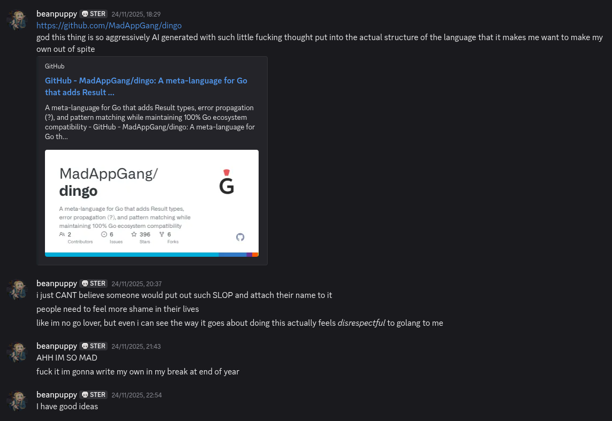

# THE DONEZO MANIFESTO

I'd like to present to you Soppo's raison d'être:



> So I'm making a callout post on my Twitter.com: Claude, you've got a small dick. It's the size of this walnut except WAY smaller. And guess what? Here's what my dong looks like.
>
> [Explosion sounds] That's right, baby. All points, no quills, no pillows — look at that, it looks like two balls and a bong. He fucked my wife, so guess what, I'm gonna fuck the Earth. That's right, this is what you get: MY SUPER LASER PISS!! Except I'm not gonna piss on the Earth, I'm gonna go higher; I'M PISSING ON THE MOON! How do you like that, Obama?! I PISSED ON THE MOON, YOU IDIOT!
>
> [https://www.youtube.com/watch?v=9XyEosgoGgg](https://www.youtube.com/watch?v=9XyEosgoGgg)

Anyway I don't like Dingo and this "DONZEO MANIFESTO" is about why.

Normally I wouldn't write something so aggressively *mean* about someone else's work, I'm not about that life. But I don't think this is someone else's work, this is AI language model Claude made by AI "safety" and research company Anthropic's work. And as such, the neurons in my brain that are supposed to make me feel bad about shitting on other people just aren't lighting up right now.

I have no issues calling Claude a piss-fuck dickhead cunt. It comes pretty naturally to me, actually.

And that's because I use it too. OHH SHIT PLOT TWIST!

I think AI tools are useful for writing code (see [this blog post](https://quaso.engineering/note/vibecoding) I wrote). The problems I have with Dingo aren't that it's "vibecoded", it's that it feels incredibly misguided - and that's probably because it was "vibecoded," if that makes literally any sense. Yeah, I'm sure you get it.

And because of that, I think this project brings great shame to Australia. And that's super weird for me to say because I am not particularly patriotic or nationalistic, so this normally isn't a thing I care about. I guess it could also be the association with dingoes.

Also this is called a manifesto as a reference to the "[Dingo Manifesto](https://github.com/MadAppGang/dingo/blob/main/MANIFESTO.md)", I for some reason read the entire thing, and... well it's conceptually *fine*, but there's a limit to the amount of LLM slop one can read before it becomes a brain damaging cognitohazard. I most certainly went over that limit.

Okay enough of the shit, what's up with Dingo? I think I can just go through the README and point to things I don't like. Hopefully you can withstand the rancid stench of Claudisms that infest it and all other documentation in the project. If not, maybe just leave now.

> Think TypeScript, but for Go.
>
> Dingo is a language that compiles to clean, idiomatic Go code. Not some franken-runtime or a whole new ecosystem. Just better syntax that becomes regular Go.
>
> The pitch: Write code with Result types, pattern matching, and null safety. Get back perfect Go code that your team can read, your tools can process, and your production servers can run at exactly the same speed.
>
> Zero runtime overhead. Zero new dependencies. Zero "what's this weird thing in my transpiled code?"
>
> Is this proven to work? Yes. Borgo (4.5k stars) already proved you can transpile to Go successfully. Dingo builds on that foundation with better IDE integration, source maps, and a pure Go implementation.

Okay let's start with "TypeScript for Go".

The value add of TypeScript is "static types for JavaScript". If we were to apply the same to Dingo - "static types for Go", yeah that doesn't make any fucking sense.

A specific design goal of TypeScript is to "[impose no runtime overhead on emitted programs](https://github.com/Microsoft/TypeScript/wiki/TypeScript-Design-Goals#goals)." It's able to do this because it does NOT generate code, the resulting JS is essentially your original TS code minus the type annotations. There are some exceptions like enums, but enums are widely regarded a mistake in TypeScript, so I'm going to ignore it.

Dingo also says it has "zero runtime overhead", which is just a fucking lie.

Dingo generates code. Your enum becomes a tagged struct with a tag field, pointer fields for each variant's data, constructor functions, and helper methods. Your `Result<int>` isn't just `(int, error)` - it's a whole struct with `IsOk()`, `IsErr()`, `Unwrap()`, `UnwrapOr()`, `Map()`, etc.

This is real boilerplate code that executes at runtime. Extra allocations, extra indirection, extra function calls. You could say "minimal" if you have numbers to back it up (which wouldn't be hard, because I'm sure it doesn't have much of an impact), but "zero"? Fuck off with that shit.

And how about it talking of a "pure Go implementation" like it's an improvement. I really don't think it is, and it shouldn't even matter if the eventual goal is to start dogfooding (which it should be).

However, I can attest - there are some nice things that come with a Go implementation. The native "ast" package would have made writing Soppo a lot easier, and because of that Dingo will probably always have better Go interop than Soppo.

But that's also because of the different architectures between the two. At the time of writing, and from what I understand after reading the code - Dingo does not do any type checking, it's a simple syntax transform and codegen, then it hands it off to Go. It's basically a fancy preprocessor.

This is not the correct approach. I don't understand why you'd add a new type (`enum`), but not type check it properly. Yes, Dingo does attempt exhaustiveness checking - but it's done by pattern matching on variant names like "Ok" and "Err", not actual type information. It only works for built-in types (`Result`, `Option`) and falls back to "cannot determine type, skip exhaustiveness check" for anything it doesn't recognise.

And even after checking, they still add a `panic` to "unreachable" parts of the generated code because Go's compiler doesn't know the match is complete. "Unreachable" or not (I seriously doubt every case this gets added in is actually unreachable), I don't think you should ever be adding panics to your generated code.

> Ever wonder what a dingo actually is?
>
> Thousands of years ago, they were domesticated dogs. Well-behaved. Following commands. Controlled.
>
> Then they escaped to the Australian wild and evolved into something science couldn't categorize. Not quite dog. Not quite wolf. Ungovernable.
>
> The Go Gopher? Created at Google. Lives by the rules. Does what it's told.
>
> Dingo broke free.
>
> Here's the beautiful part: dingos are still canines. They didn't reject their DNA—they just refused to be controlled. Same with our language.

What? I hate everything about this.

"Categorise" is also spelt wrong. Not very Australian of you.

```go
enum Result {
    Ok(value: int),
    Error(message: string)
}

func divide(a: int, b: int) Result {
    if b == 0 {
        return Error("division by zero")
    }
    return Ok(a / b)
}

let result = divide(10, 2)
match result {
    Ok(value) => fmt.Printf("Success: %d\n", value),
    Error(msg) => fmt.Printf("Error: %s\n", msg)
}
```

Finally, some code.

WHY THE FUCK DOES IT LOOK LIKE RUST?

Look, I love Rust more than anything else in the world. I DON'T WANT MY GO CODE LOOKING LIKE RUST WHAT BLASPHEMY IS THIS?

BURN THIS SHIT TO THE GROUND STRAIGHT TO HELL AND THEN TO PURGATORY FOR A FALSE SENSE OF SECURITY BUT THEN DROP KICK IT BACK INTO SUPER HELL BECAUSE FUCK YOU AND YOUR FATHER SPECIFICALLY FOR REASONS I'M NOT EVEN SURE ABOUT.

There's also a pretty severe design flaw with this, can you spot it?

That's right! `Ok` and `Err` are bare identifiers! They aren't namespaced to `Result`. So what would happen if you wrote this:

```go
enum Result {
    Ok(value: int),
    Error(message: string)
}

enum NetworkResult {
    Ok(data: string),
    Error(code: int)
}
```

What happens when you write `Ok(...)`? Which one is it?

```go
// Property access with safe navigation
let city = user?.address?.city?.name ?? "Unknown"

// Method calls with safe navigation
let email = user?.getProfile()?.email ?? "noreply@example.com"

// Works with Go pointers too!
let timeout = config?.database?.timeout ?? 30

// Chained defaults
let theme = user?.theme ?? project?.theme ?? global?.theme ?? "light"
```

This is too many question marks. Especially when you add in using `?` to propagate errors. It's too fucking many dude.

Like it's a fine idea... probably (I haven't thought about it very hard), but like... ugh.

```go
let numbers = []int{1, 2, 3, 4, 5}
let doubled = numbers.map(func(x int) int { return x * 2 })
let evens = numbers.filter(func(x int) bool { return x % 2 == 0 })
let sum = numbers.reduce(0, func(acc int, x int) int { return acc + x })
```

Functional constructs outside of non-functional languages are overrated.

In functional languages, `map`, `filter`, and `reduce` aren't valuable for what they do directly. They're valuable because they compose with other recursion schemes - calling a function `map` doesn't give you the same `map` you'd have in OCaml.

OCaml's `map` over a list is a specialisation of a more general pattern: a functor. This means you can swap in a different data structure (trees, options, results) and map still works, with the same laws and guarantees. In JavaScript, `Array.prototype.map` is just a method on arrays. It doesn't compose with anything. You can't generalise it, swap the container, or build larger abstractions from it.

There's also a performance cost. Chaining `map`, `filter`, and `reduce` in most languages creates intermediate arrays at each step. Instead of one loop doing 3 things, you get 3 loops producing 3 arrays. Haskell solves this with fusion optimisations that collapse the chain back into a single pass. Rust solves it with lazy evaluation. Go does NOT solve this because it was never designed to.

And that's fine, it doesn't need to. So stop trying to ham-fist it in.

Fun fact: Soppo was almost written in Ocaml because I thought "if it was good enough for Rust, it's certainly good enough for this shit." But I decided against it because I'm not very confident in Ocaml (could have been a good excuse to get better though now that I'm thinking about it).

Anyway, the rest of the README is kinda meandering and repeats a lot of the same talking points and information (thanks Claude), so I think I'm actually just done with this. Sorry, we didn't even get halfway through the README. Guess I was the one who couldn't handle the Claudisms...

How about we actually go into the internals? Does that sound good to you baby girl?

So, Mr Dingo, here's a world renowned and ISO certified "beanpuppy code review" given to you for FREE. I know, I am incredibly generous - you don't need to keep praising me.

The first thing that jumps out to me is the amount of `TODO`s. I know from experience Claude (and other LLMs probably) love adding `TODO`s because it thinks something is too complex to do right now, and it should leave it for later.

This is usually bad because it means Claude hasn't/won't think about the problem holistically and has come up with some shit that it can't extend later without fucking everything up. Instead, it just tried to find the first and simplest solution that solves whatever issue it's trying to solve. This is not good for long term code quality.

Another big problem is that Dingo doesn't use a lexer and runs regex directly on source code. [Lexical analysis](https://en.wikipedia.org/wiki/Lexical_analysis) is a pretty important step to compilation, so I dunno why you'd just... not do it?

Without a lexer, you're doing surgery blindfolded - regex can't tell if `??` is an operator or inside a string, if `=>` is a lambda or in a comment, if `{` starts a block or is in a template literal. A lexer reads the source once, tracks state (am I in a string? a comment? how deep in braces?), and outputs a clean token stream where each piece is labelled and safe to transform.

Any language that handles strings, comments, or nested structures (which is basically all of them) needs this foundation.

Let me expand further on this. If you know compiler design, you'd expect something like:

```
Source -> Lexer -> Parser -> AST -> Type Checking -> Codegen -> Output
```

(Oh hey that's basically straight out of the Soppo docs)

Parse first, get a structured representation of your language, then analyse and transform. From what I can gather, this is Dingo's architecture:

```
Source (.dingo)
      v
Regex transforms text into Go code
      v
[go/parser.ParseFile()]                <- Go's standard library parser
      v
*ast.File (creates an AST of Go code)  <- Go's standard library AST types
      v
Plugins modify the Go AST
      v
[go/printer]
      v
Output (.go)
```

Notice the inversion. The structured representation comes after the main transforms, and it's Go's structure, not Dingo's. There is no Dingo AST ([Abstract Syntax Tree](https://en.wikipedia.org/wiki/Abstract_syntax_tree)).

The "Plugins" step exists because regex can't do semantic work. It can transform `x?` into `error` handling boilerplate, but it can't figure out types. So plugins walk the Go AST looking for patterns - see a function call named `Ok`? That's probably a `Result` constructor, so infer the type, generate a struct declaration, and rewrite the call. It's pattern matching on names, not actual Dingo semantics.

The division of labour is backwards, and as a result:

- Without a type checker to check Dingo types, exhaustiveness checking can only recognise hardcoded built-in types like `Result` and `Option` by matching on variant names - user-defined enums can't be checked because there's no type information to know which enum a value belongs to
- It would be difficult to build a formatter, linter, or proper LSP (not just relying on gopls - I'm not sure how far you could go with that) because there's no Dingo AST to work with

Fixing these issues likely requires building most of a proper frontend anyway, at which point you might as well design it coherently from the start.

> Update 2025-11-30:
>
> So it turns out Dingo has recently migrated away from using regex to a proper tokeniser (only for enums right now, but I'm assuming the idea is to do it for all Dingo features). This is a step in the right direction and is good. Doesn't change the fundamental problems with the architecture though.
>
> But I've also looked at this `ai-docs/AST_MIGRATION.md` document in the repo, and it kinda looks like they want to move towards a more traditional compiler? There's a "Target Architecture" section with a diagram that looks like this:
>
> `Dingo Parser -> Dingo AST -> Go Codegen`
>
> Like that's basically the standard architecture I've been talking about. So if it is moving towards this, fair enough I guess? Most of my critiques at that point will become invalid.
>
> I just don't understand why it wasn't done like this in the first place. It's not like it's much slower to prove out or anything (I mean... just look at Soppo), and it's going to take a lot longer to fix (and thus cost more... because AI) than just doing it right the first time.
>
> Anyway, I think I'm done trying to read this code ever again - it genuinely hurts my brain.

If this were a human writing it, I'd tell them to read one of the canonical books on this stuff ["Crafting Interpreters"](https://craftinginterpreters.com/) to actually understand how things like this are supposed to be made.

I'm completely speculating here, but I think Dingo's architecture emerged because Claude started using regex first as it's simple and handles most syntax transforms, along with using Go's parser because why bother making your own?

Then plugins then came to fill the gap for things regex can't handle. I mean, I honestly doubt this is correct - but it really *feels* like it, and that isn't a good sign.

The "extensible plugin system" framing is optimistic. Yes, someone could theoretically write a plugin, but they'd need to understand Go's AST types, what the regex stage already transformed, and how to coordinate with other plugins in order to not break each other.

I think it would be more accurate to say plugins are more how Dingo organises its internal code than a community extension point. Though I think it would be nice to be proven wrong, as it's an interesting idea *in theory*, but there's probably a reason other languages haven't done it.

Although, if Dingo managed to actually get plugins working in a reliable state in this fucked up bizarro world architecture, that would be a much greater achievement than just "making a better Go" and its innovation in compiler design should be shown off front and centre of the project instead.

It'd be like how Go ignored the last 50 years of garbage collector research to do their own thing; Dingo also ignored the last 50 years of compiler research to do its own thing. Except hopefully, this time it will be an improvement. Unlike with Go.

Finally, I get that like this isn't really supposed to be read by humans (which is a bad thing btw), but I don't think that excuses these all files being here.

```bash
[I] justin@vingtcinq ~/d/l/d/p/preprocessor (main)> ls -1a
./
../
config.go
config_test.go
enum.go
enum_test.go
enum_v2_test.go
enum_v2_test.go.bak2
enum_v2_test.go.bak3
error_prop.go
error_prop_v2_test.go
function_cache.go
function_cache_test.go
generic_syntax.go
import_edge_cases_test.go
keywords.go
lambda_bench_test.go
lambda_errors_test.go
lambda.go
lambda.go.backup
lambda.go.backup-c1
lambda_test.go
lambda_v2_test.go
lambda_v2_test.go.bak2
lambda_v2_test.go.bak3
null_coalesce_bench_test.go
null_coalesce.go
null_coalesce_test.go
null_coalesce_v2_test.go
null_coalesce_v2_test.go.bak2
null_coalesce_v2_test.go.bak3
null_coalesce_v2_test.go.bak5
null_coalesce_v2_test.go.bak6
package_context.go
package_context_test.go
preprocessor_cache_test.go
preprocessor.go
preprocessor_test.go
README.md
rust_match.go
rust_match_nested_test.go
rust_match_test.go
safe_nav_bench_test.go
safe_nav.go
safe_nav_test.go
safe_nav_v2_test.go
safe_nav_v2_test.go.bak2
safe_nav_v2_test.go.bak3
safe_nav_v2_test.go.bak5
safe_nav_v2_test.go.bak6
sourcemap.go
SOURCEMAP.md
sourcemap_test.go
sourcemap_validation_test.go
stdlib_registry.go
stdlib_registry_test.go
ternary.go
ternary_test.go
tuples_destructuring_test.go
tuples.go
tuples_test.go
type_annot.go
type_annot_v2_test.go
type_annot_v2_test.go.bak2
type_annot_v2_test.go.bak3
type_annot_v2_test.go.bak4
type_detector.go
type_detector_test.go
unqualified_imports.go
unqualified_imports_method_test.go
unqualified_imports_test.go
```

Like seriously... have some respect.

## Epilogue

Since you got this far in my little rant, I guess I can explain the reasoning behind Soppo as a treat for you :3

Go isn't very good. And I don't think just adding new features it will ever make it good. It has a very clear design goals, ones I don't agree with.

So no, I don't think giving Go features from Rust will make me like the language, because if you're doing that, why shouldn't I just keep using Rust? All you're doing is confirming to me that Rust is the better language.

Just taking features from other languages also isn't a good way of designing a language. You need vision, a divine providence.

I want Soppo to follow Go's vision, even if I think it's stupid and has lead to a shit language. Okay shit is a bit harsh, I don't think Go is shit. I think it's a war crime against everything I love about programming.

(THAT WAS A JOKE)

Now obviously if what Soppo adds is actually in Go's vision, Go would have, you know, added it already. So what I'm actually doing is pretending "type safety and developer ergonomics" are part of Go's vision and imagining what the Go devs would add in this unfortunately completely fictional scenario.

And I settled on "type safety and developer ergonomics" because that is what I think is missing from Go for me to actually want to use it. I dunno man, the fact that it just straight up lets you access a nil reference... what the fuck guys? Like what are we even doing here?

That being said, I'm not confident Soppo will make me want to use Go even if it achieves all its goals. As you know, it's a project built from pure hater energy, and once all the venom starts to wear off as I'm able to affirm to myself that "yeah I could do this better", what reasons do I have for doing this?

Because at the end of the day, why not just use Rust?

Well, I guess just for the fun of it. I'd do anything for my wife.

<p align="center">
  
</p>

(THAT WAS ALSO A JOKE I AM NOT MARRIED TO AN ANIME RAIFU*)

*Rifle waifu
